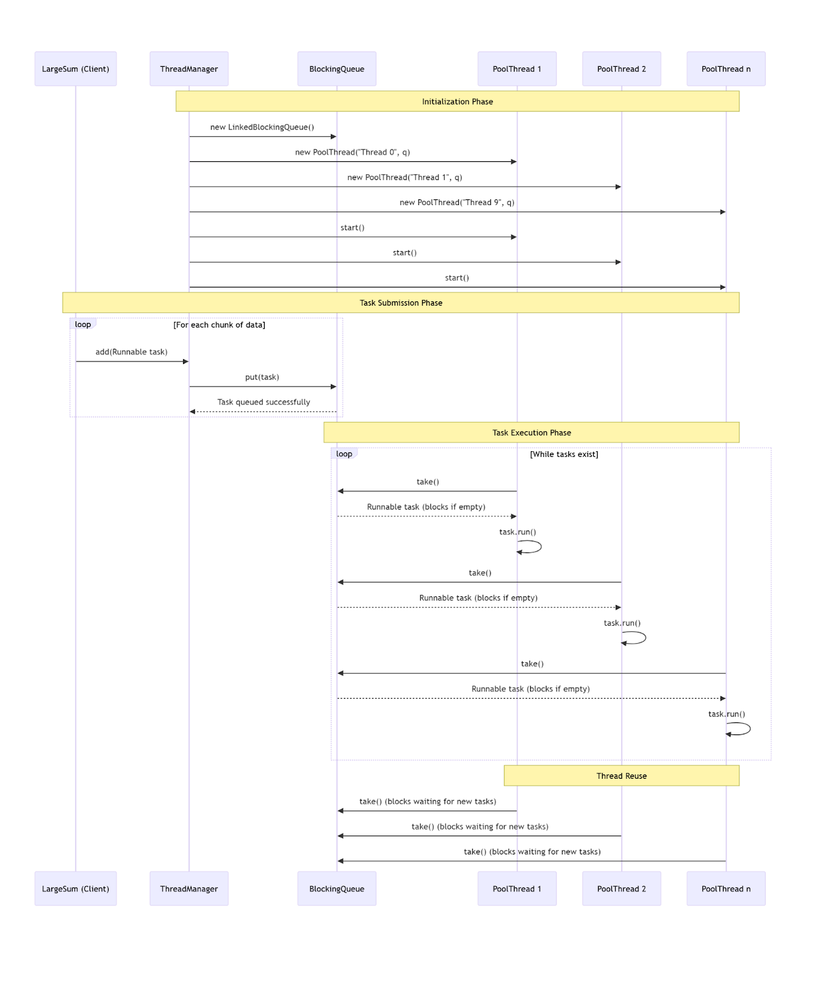

**SWEN-755 \- Group 3**  
**Thread Pooling**

**Group Members:**  
Ashley, Christian, ca5138  
Londhe, Soudagar, srl1622  
Yocum, Ryan, rty4159

**1\. Introduction :**   
Thread pooling is a performance tactic that seeks to limit the overhead of Thread creation through reuse of existing resources. Additionally, it can support availability and security attributes by limiting the number of resources to prevent a system from being overwhelmed (i.e. DoS attacks). To achieve this goal, actions taken by a program must be defined as runnable tasks (i.e., Runnables in Java, first-class functions, closures). A Queue is used to keep track of the order in which tasks are executed, and it must be a BlockingQueue so that threads do not attempt to take a task from the queue simultaneously. Threads will take and execute tasks in the BlockingQueue, or wait until there is a task to run.

**2\. Github repo link :**   
[https://github.com/Enixun/SWEN-755-Thread-Pool](https://github.com/Enixun/SWEN-755-Thread-Pool)

**Commands**
```bash
javac -d . **/*.java
java LargeSum
Ctrl+c to stop the thread pool
```

**3\. Sequence diagram :**   
The process begins with the ThreadManager initializing a central blocking queue and creating a pool of ten worker threads. These threads start up and immediately try to take a task from the queue, but since it’s empty, they all simply wait there, blocked and dormant. Meanwhile, the main client, LargeSum, split its massive workload, summing a huge array into smaller, manageable task chunks. It submits each of these chunks as a Runnable to the ThreadManager, which places them into the queue. As tasks arrive, the waiting threads are automatically activated, each assigned one task from the queue. They execute their specific chunk of the calculation independently, and the key to the pool’s efficiency is what happens next, as soon as a thread finishes its task, it doesn’t shut down but instead goes right back to the queue to wait for the next piece of work. This cycle continues, reusing the same ten threads over and over until all tasks are complete, effectively minimizing the overhead of constantly creating and destroying threads.  

